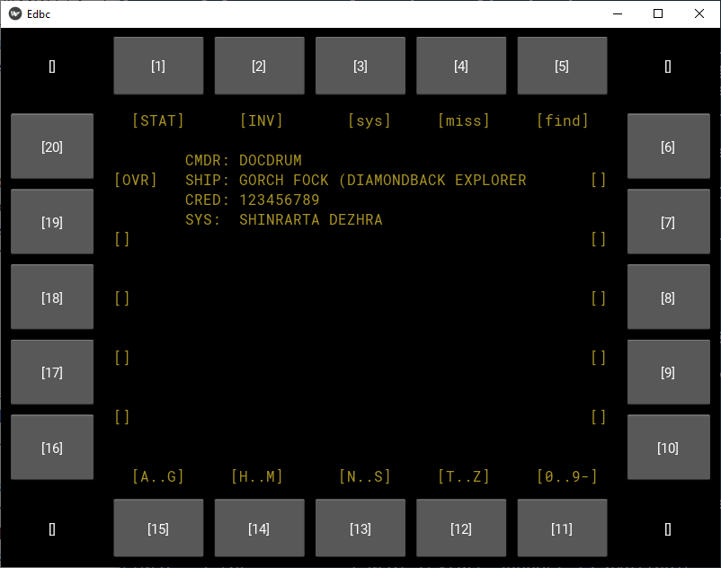
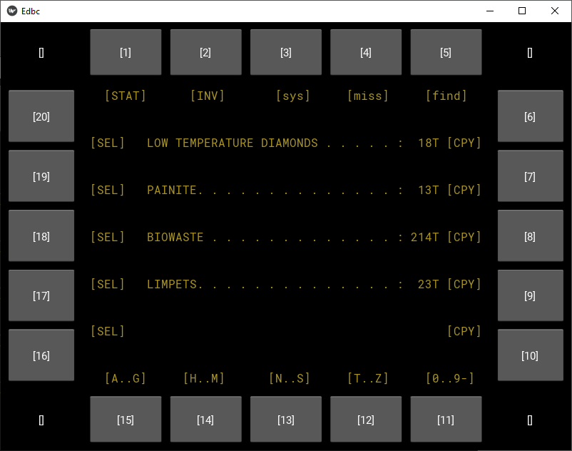

# (Yet another?) Elite:Dangerous board-computer

## PROTOTYPE-STAGE, UNUSABLE!
This is at this time (at best) a mock-up. Most screens are fake, and when the
screen is working, the data is fake. There is no connection to hardware inputs,
the Frontier-API, local game data or third-party-tools like EDDB or Inara.

## Why EDBC?
EDBC is the Elite:Dangerous Board Computer. I'm quite astonished, that I could
not find a project using exactly that name. If there is already an established
project, I'll change the name, but for now I will stick with that.

## Background
I find the in-game-tools severely lacking, and rely in my usual gaming heavily
on tools like EDDB. Alt-Tabbing out of the game is immersion-breaking
to-the-max, and because I fly 100% HOTAS/VR I have to 'leave the cockpit'
everytime I want to lookup something on the internet, that would 'in reality'
be provided by my 'board-computer or some kind of in-game internet-like device.
This is the itch I want EDBC to scratch.

## Development Screenshots

## Features
 - on FSD-Jump, show a fast overview of the target-system. Quite what
   EDDI/EDDiscovery does, but without chewing my ear off for about five minutes.
   Just a quick display of what star-class I'm at (scoopable?), system
   population, maybe if it's worth it to honk or scan individual planets.
 - I found something nice floating in space, get a cargo-type mission reward,
   or finish my mining session. Quickly lookup possible stations where I could
   sell this stuff, and "prepare the autopilot". That is most probably
   implemented as an estimation of how many jumps it takes to get there, copy
   the target system to the clipboard, and have a continuous display of the
   destination station, so I can quickly grab it from the nav-panel, when I have
   arrived.
 - Got a "bring me a shrubbery"-mission? Find the nearest station where a
   shrubbery-salesman has setup shop.
 - Custom bookmarks. Instead of maintaining a long list of nonsensical text
   entries in E:D's Galaxy Map, have a system of hierarchical and/or taggable
   entries. Filter by "double hotspot / painite" and sort by distance.
 - (intentionally left blank)
 - (space for future ideas)

## Soft goals (or better, design visions. Future will tell if any of these get implemented)
 - VR-viewable. I want to place a virtual display in my VR-cockpit, that is
   actually readable. I could do the same with a Firefox-panel, but most pages
   are unreadable in VR when using a reasonably sized panel. Zooming doesn't
   work, because the html-layouts don't handle 250%+-Zoom levels well. I want
   the minimum amount of information, on a small, readable display.
 - VR-interaction. I have fighter-jet-style MFD-button-frames, any interaction
   with EDBC should be possible with these panels. On a side note, I like the
   aesthetics of fighter-jet-mfds, so that is also a minor design goal.
 - Externalizable. I love the DIY-cockpits lots of people around the internet
   have come up with. Someday(tm) I might build my own. EDBC would certainly
   have a place in there. To make this easier, I want EDBC to be independent
   of the computer running Elite. This is a minor goal for now, and while I
   have some Ideas of how to implement this, I'm only focusing on separating
   inputs and outputs from the core application. I want to do only minor
   changes if I switch from directly reading the game-log, to receiving
   game-events via network, provided by a small log-reading server process. I
   want to only do minor changes if I switch from handling
   Windows-Joystick-Events to reading hand-built buttons via Arduino, and the
   program running on a Raspberry Pi.

## My story
I'm not coding right now in my day-job, so I need a hobby-project to feed the
monkey. Also, I want to learn some new stuff (just for shits and giggles, not
because "I need experience in kivy"), and make one of my favourite games even
better.

I have some experience in working with Python, but there are tons of aspects in
this project, that are quite new for me.
 - Software-development on Windows. I'm a Linux-person and hate windows,
   especially for development work. Will be interesting to find workarounds for
   the most infuriating downsides. My first step: use PowerShell. Not sure if
   that fixes more problems than it creates, though...
 - Eclipse. I'm using PyDev, because this is also used at my workplace. I could
   successfully avoid using eclipse, I consider Linux+Vim/Emacs plus utilities
   like a decent shell, grep and [e]tags a far superior development environment
   for almost any language. Now I'm stuck on Windows, so I have to do without
   my favourite toys.
 - kivy. I recently saw a Youtube-Video about kivy, and I was intrigued. So
   far, it seems like a good match for my intended workflow, although I haven't
   even started to understand how it really works.
 - handling joystick input. Never done that, should be interesting. Even more,
   I want to handle the input _while not having focus_.  Don't even know, if
   this is possible.
 - SQL. I did some SQL-projects (mostly MySQL, back in the LAMP-days) and I
   love it. I could not find an easy to access web-API to request market-data,
   for example, so I'm playing with the idea to create a local PostgreSQL
   database based on the EDDB dumps as a data source for EDBC.
 - Hardware-DIY. Yeah, someday...

## How do I download/build/test EDBC?
Yeah, I have no idea. You can fork/clone the project using git/github, but
from that point on you're on your own. I'm using github as a backup of my
development folder, and I run the program straight from that directory, so I
have not spent time on building/deploying. As a hint: I use
virtual-environments (python -m venv env, env/Scripts/activate.ps1), and the
additional packages get installed via 'pip install kivy'. I try to keep the
requirements.txt file updated, so 'pip install -r requirements.txt' should
work. To run EDBC execute 'python main.py' in the src/edbc folder.

## I have (found) a similar project, maybe you want to try that?
Really? I haven't. Agreed, I didn't look very hard, but the projects I found
didn't work in VR or didn't serve my goals. I'd love to take a look at your
project, but probably I'll continue building my own, just for the fun of it.

## That sounds cool, I want to help!
For real? Dunno about that. Really, I can't make up my mind, if I even want
help. Currently, the project is not even stable in it's most basic functions
(i.e. I started on wxPython, recently switched to kivy), I feel I need
absolute control over every line of code, so I can better find and fix what's
in the way of further development.

That being said, I would like to hear about suggestions of new features,
solutions to problems, even bugreports. When the main platform gets more
stable, I'll be happy to collaborate more.
